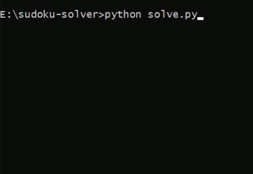

# 🧩 Sudoku Solver

## 📌 Project Overview
This project is a **Sudoku Solver** that takes an input puzzle in the form of an **81-character long string**, where:
- Digits `1-9` represent filled cells.
- Digit `.` represents an **empty cell**.

The program replaces all the `0`s with valid digits such that the Sudoku puzzle is completely solved.

---

## ✅ Rules of Sudoku
A valid Sudoku solution must satisfy the following:
1. Each digit `1-9` must appear **exactly once** in every row.
2. Each digit `1-9` must appear **exactly once** in every column.
3. Each digit `1-9` must appear **exactly once** in each of the **nine 3x3 sub-grids**.

---

## ⚙️ Algorithm Used
A brute force approach would require trying out all possible combinations  
(~ `2 × 10^77` in the worst case 😱), which is practically impossible.  

To solve this efficiently, we use the **Backtracking Algorithm**:
- Place a valid digit in the empty cell.
- Recursively try to solve the rest of the board.
- If a contradiction occurs, **backtrack** and try a different digit.
- Repeat until the board is solved.

This drastically reduces computation time and ensures a solution is found for solvable puzzles.

---

## 🖥️ Input Format
- Input: A single **81-character string** containing digits `0-9`.

